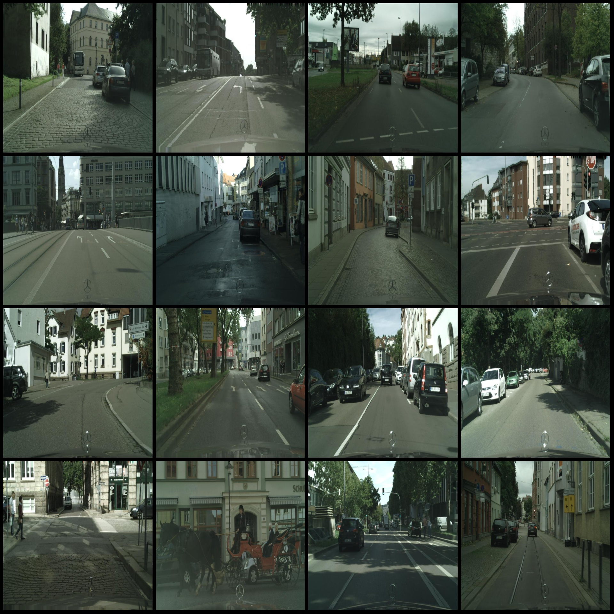
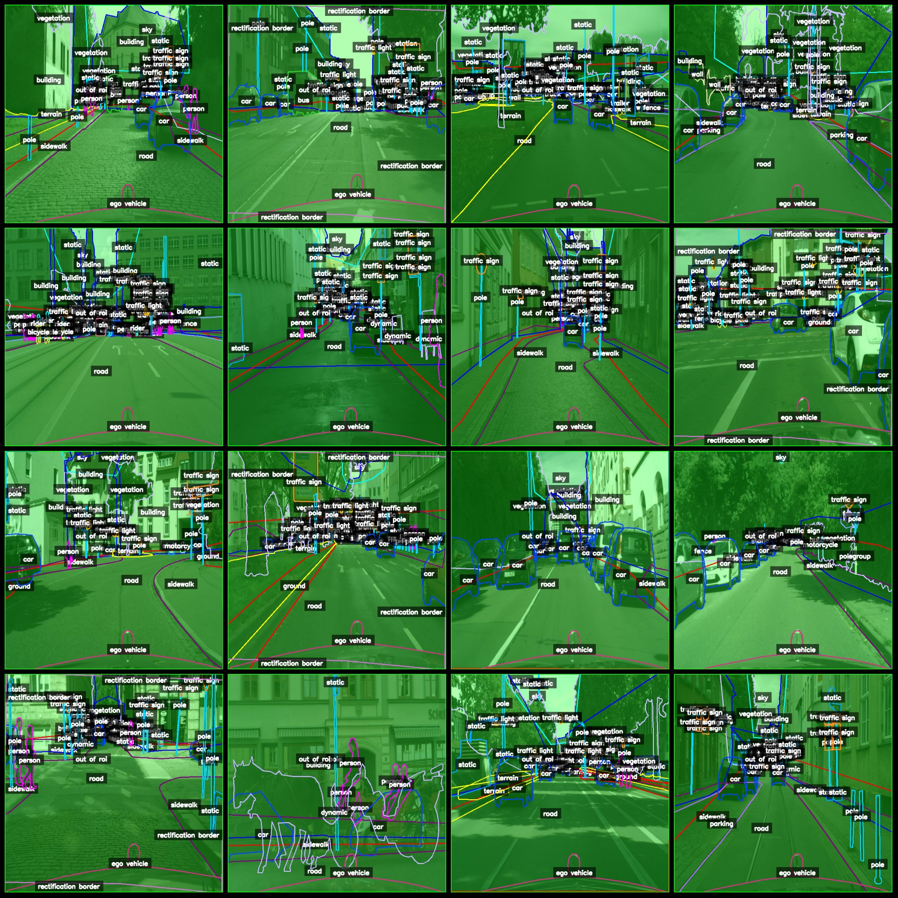
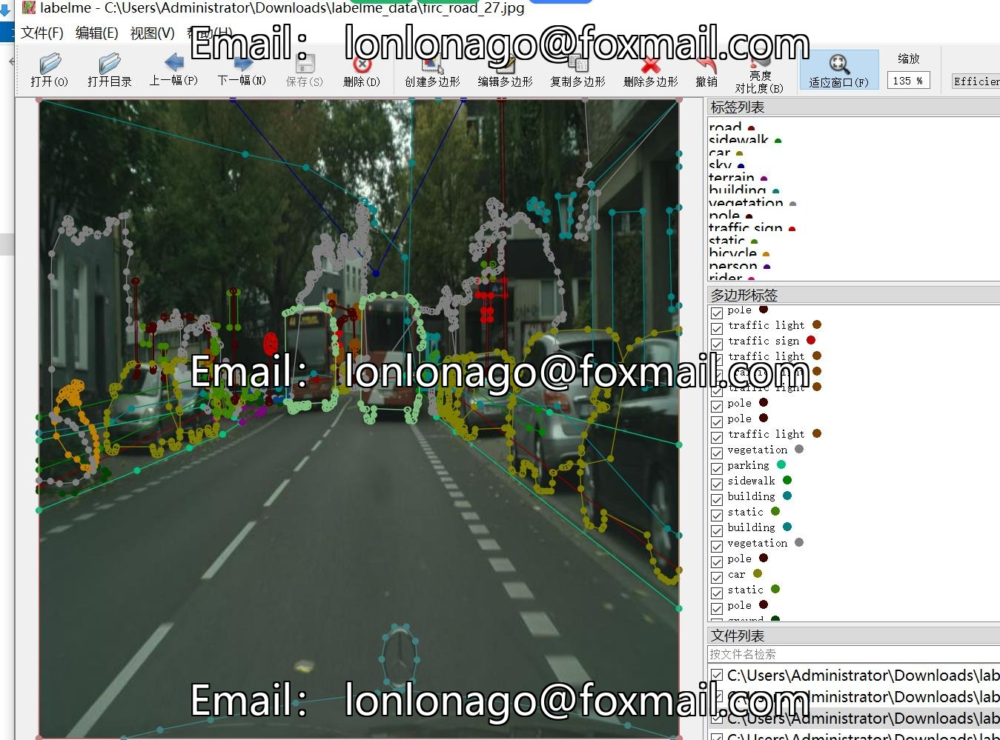

# Intelligent Transportation and Autonomous Driving: Road Obstacles, Road Target Identification and Segmentation Dataset in LabelMe Format with 1994 Images and 34 Categories

Dataset format: LabelMe format (without maskfile, only including jpgimage and corresponding jsonfile)
number of images: 1994  
annotation count: 1994  
annotationnumber of classes: 34  
annotation class names:["bicycle","bridge","building","bus","car","caravan","dynamic","ego vehicle","fence","ground","guard rail","motorcycle","out of roi","parking","person","pole","polegroup","rail track",
"rectification border","rider","ridergroup","road","sidewalk","sky","static","terrain","traffic light","traffic sign","trailer","train","truck","tunnel","vegetation","wall"]  
boxes per class:   
This means there are 2427 bicycles in total.
Bridge count = 188
Building count = 4744
Bus count = 230
Car count = 17369
Caravan count = 30
Dynamic count = 2369
Ego vehicle count = 1992
The fence count is 1592.
Ground: 1222
Guard rail: 68
Motorcycle: 515
The output of ROI (Region of Interest) count is 1992.
Parking count = 664  
Person count = 11340  
Pole count = 28129  
Pole group count = 202  
Rail track count = 72
Rectification border count is 2772.
The count of riders is 1139.
Rider group: 7
Road: 2080
Sidewalk: 4813
The sky is a vast expanse of blue and white, with fluffy clouds that seem to dance in the air. It's a beautiful sight, but also a reminder of how small we are compared to the universe. Counting the number of stars in the sky is like counting the grains of sand on the beach - it's impossible! But even so, there are 1975 constellations in the sky, each with its own unique shape and meaning.
The count of static objects is 25572.
The number of terrains in the YOLOv3 model is 2767.
count = 6570
The count of traffic signs is 13995.
Trailer count = 45
Train count = 118
Truck count = 304
Tunnel count = 23
Vegetation count = 9849
Wall count = 1106
total boxes: 148280  
Using Annotation Tool: labelme=5.5.0
image resolution: 640x640  
Annotation Rules: Draw polygons around the class for polygon.
Important Notes: You can use LabelMe to open and edit the dataset, and JSONDataset needs to be converted into a mask or Yolo format or Coco format for semantic segmentation or instance segmentation.
Special Statement: This dataset does not guarantee the accuracy of any trained models or weight files.
Image Preview:
## Images

Here is a pay link on Stripe ( https://buy.stripe.com/3cs8yP7sY87d0vu9AB ). Please contact me lonlonago@foxmail.com after funding $89, and I will send you a complete data files , thank you!

